<div align="center">
  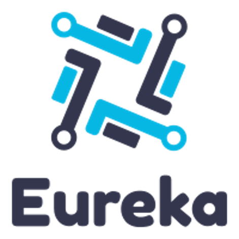

  # Issue Tracking & Management System

  A full-stack issue tracker for managing products, subsystems, releases, new features and bugs.

  
  
  
  
</div>

---

## Overview

Eureka is an internal issue tracking and management system, originally built as a capstone project. Teams register **products**, break each product into **subsystems** and **release versions**, and then log, triage, assign and resolve **issues** against them — similar in spirit to Jira, scoped down to the essentials.
It supports role-based access (Users, Developers, Managers, Admins), localized UI in three languages, email notifications, and a set of security features (hashed passwords, HttpOnly session cookies, throttled login attempts) covered below with screenshots.

## Features

- **Product & issue tracking** — products → subsystems → release versions → issues, with filtering by product, subsystem, release, status, severity, reporter and assignee
- **Role-based access control** — per-user roles (User/Admin) and types (Developer/Manager), organized into groups, enforced with Spring Security
- **Secure authentication**
  - Passwords hashed with **BCrypt** before storage
  - Session cookies flagged **HttpOnly**
  - "Remember me" login persistence
  - Repeated failed logins are **throttled** with a localized cooldown message
- **Email notifications** — assignees get an email the moment an issue is assigned to them (Spring Mail / SMTP)
- **Internationalization** — full UI translations for **English, Russian and Armenian**
- **User management** — admins can add, edit, promote/demote and delete users, with profile photo upload
- **Responsive CRUD UI** — Thymeleaf + Bootstrap + jQuery DataTables, with sortable, searchable tables throughout

## Screenshots

### Sign in & localization
<p>
  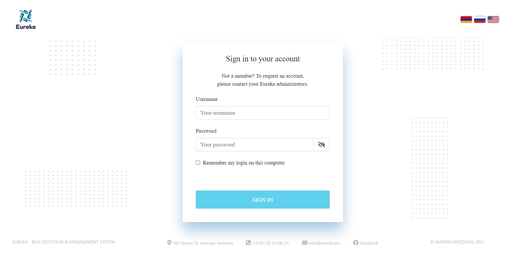
</p>
<p style="text-align: center">
<i>The sign-in screen, available in English, Russian and Armenian.</i>
</p>

<p align="center">
  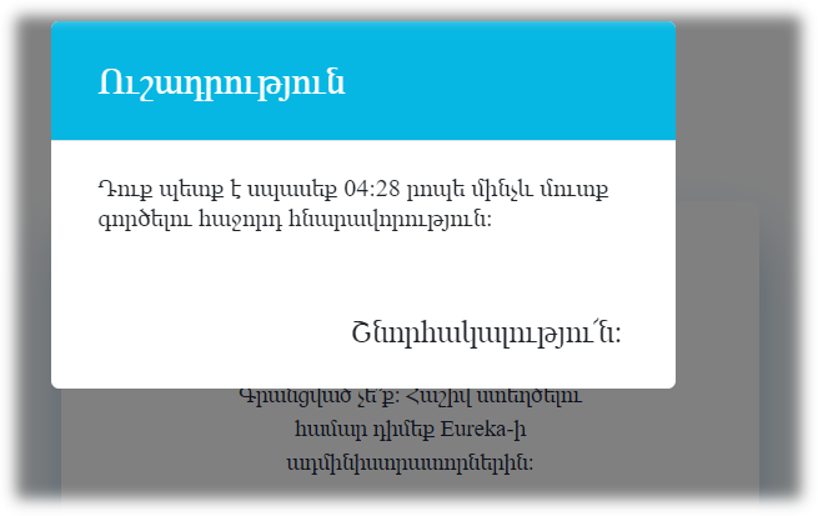
</p>
<p style="text-align: center">
<i>After too many failed attempts, login is temporarily throttled — shown here in Armenian.</i>
</p>

### Issue tracking
<p>
  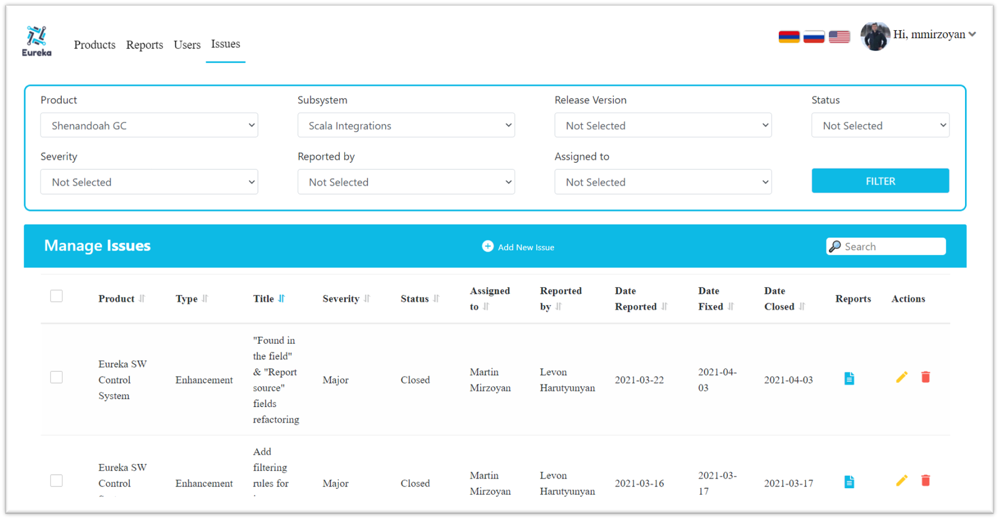
</p>
<p style="text-align: center">
<i>Issues can be filtered by product, subsystem, release version, status, severity, reporter and assignee, and sorted on every column.</i>
</p>

<p>
  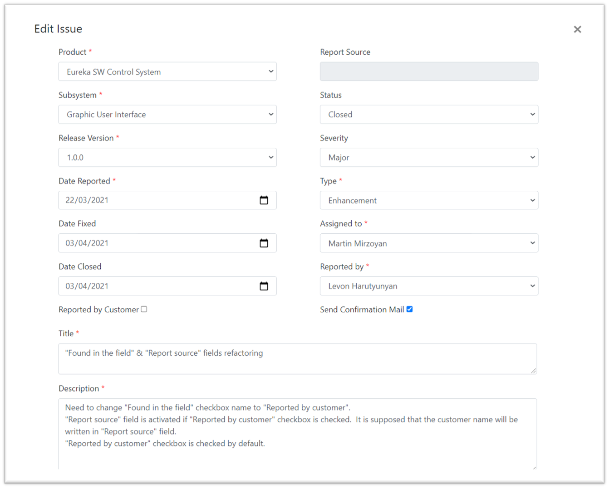
</p>
<p style="text-align: center">
<i>Each issue tracks its full lifecycle — report date, fix date, close date, severity, type, source, and whether it was reported by a customer — with an optional confirmation email to the assignee.</i>
</p>

<p align="center">
  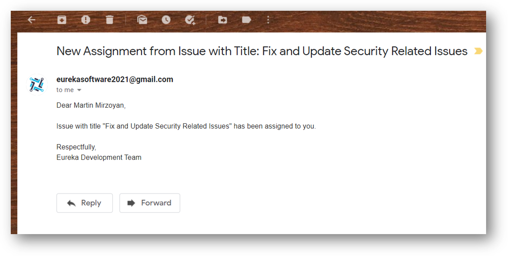
</p>
<p style="text-align: center">
<i>Assignees are automatically emailed when an issue is assigned to them.</i>
</p>

### Products & subsystems
<p>
  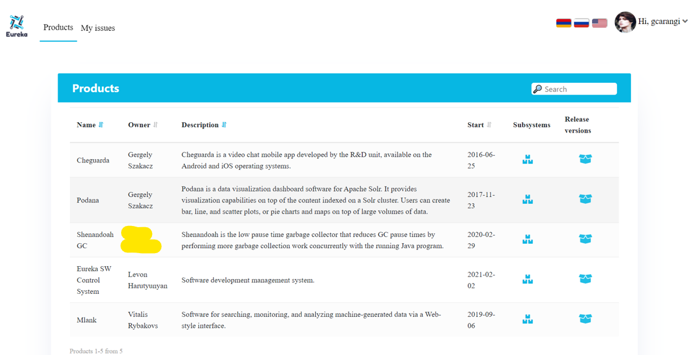
</p>
<p>
  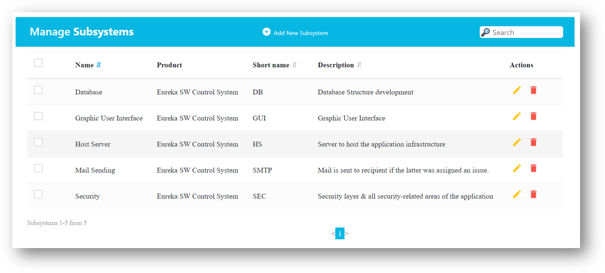
</p>

### User management & profiles
<p>
  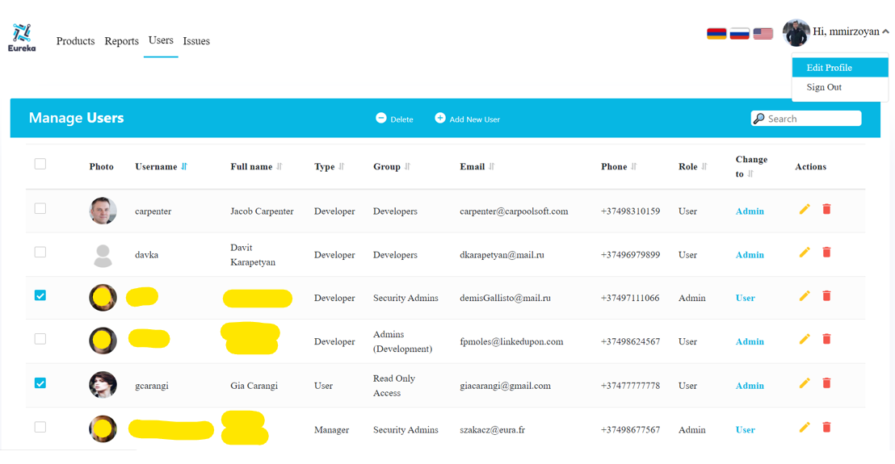
</p>
<p align="center">
  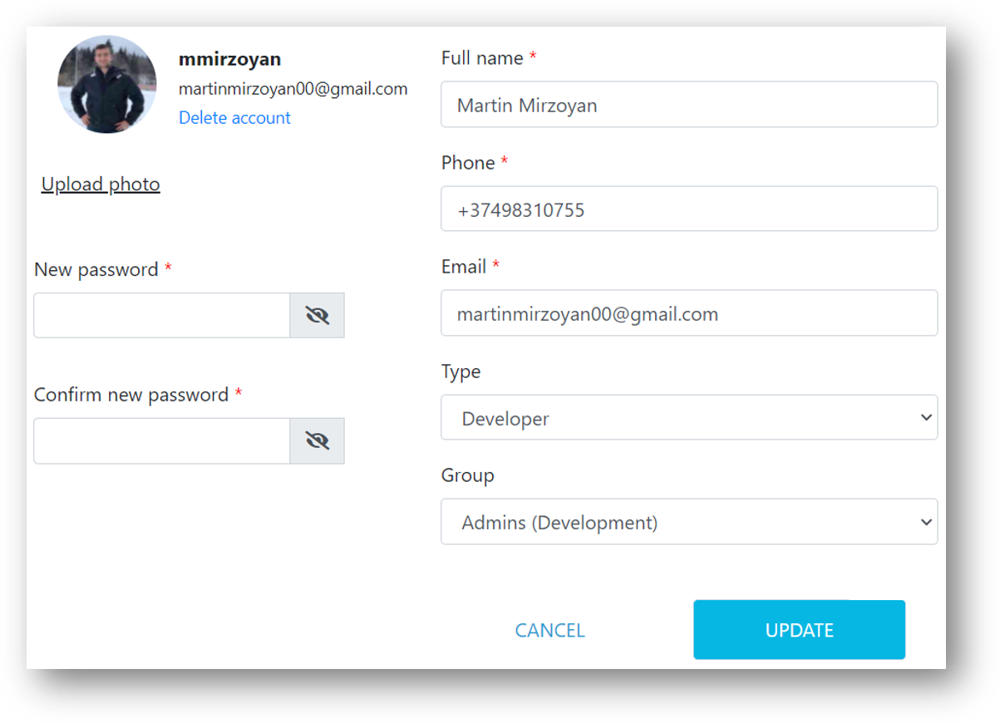
</p>

### Security in practice
<p>
  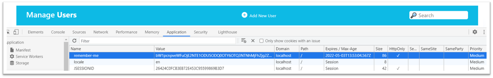
</p>
<p style="text-align: center">
<i>Session cookies are <code>HttpOnly</code></i>
</p>

<p>
  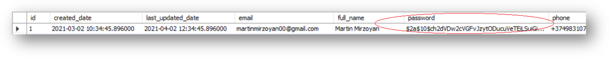
</p>
<p style="text-align: center">
<i>Passwords are stored as BCrypt hashes, never in plaintext.</i>
</p>

## Data Model

<p align="center">
  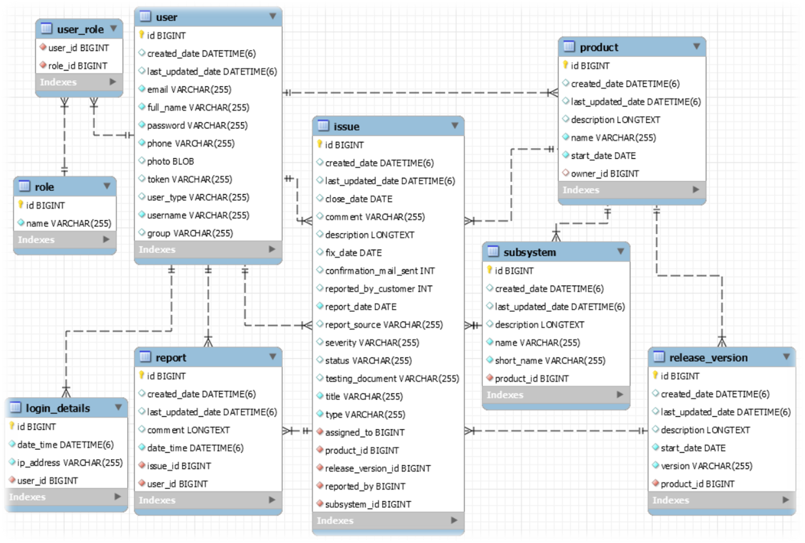
</p>
<p style="text-align: center">
<i>Core entities: <code>user</code>, <code>role</code>, <code>user_role</code>, <code>login_details</code>, <code>product</code>, <code>subsystem</code>, <code>release_version</code>, <code>issue</code>, <code>report</code>. An issue belongs to a product, subsystem and release version, and can have multiple reports (comments/updates) attached to it.</i>
</p>

## Tech Stack

| Layer          | Technology |
|----------------|------------|
| Language       | Java 11 |
| Backend        | Spring Boot, Spring MVC, Spring Data JPA, Spring Security, Spring Mail |
| Templating     | Thymeleaf |
| Frontend       | Bootstrap 4, jQuery, jQuery UI, jQuery Validation, jQuery.i18n, DataTables |
| Database       | MySQL 8 |
| Object mapping | MapStruct |
| Build          | Maven |

## Getting Started

### Prerequisites
- Java 11+
- Maven (or use the bundled `./mvnw`)
- A running MySQL 8 instance
- An SMTP account (e.g. a Gmail account with an [app password](https://support.google.com/accounts/answer/185833)) for sending notification emails

### Configuration

Eureka reads its database and mail credentials from environment variables — nothing sensitive is hardcoded. Copy the example file and fill in your own values:

```bash
cp .env.example .env
```

```dotenv
# --- Database ---
DB_URL=jdbc:mysql://localhost:3306/eureka
DB_USERNAME=root
DB_PASSWORD=

# --- Mail ---
MAIL_HOST=smtp.gmail.com
MAIL_PORT=587
MAIL_USERNAME=your-email@gmail.com
MAIL_PASSWORD=your-app-password

# --- Security ---
SECURITY_SECRET_KEY=change-this-to-a-long-random-string-in-production
```

Export these (or use a tool like [`direnv`](https://direnv.net/) / your IDE's run configuration) before starting the app.

### Run locally

```bash
git clone https://github.com/<your-username>/eureka.git
cd eureka
export $(cat .env | xargs)   # or configure the variables another way
./mvnw spring-boot:run
```

The app will be available at `http://localhost:8080`. Schema tables are created/updated automatically on startup (`ddl-auto: update`) against the database referenced by `DB_URL`.

### Build a jar

```bash
./mvnw clean package
java -jar target/eureka_app.jar
```

## Security Notes

- All credentials are supplied via environment variables (see [Configuration](#configuration)) — the repository contains no live secrets.
- User passwords are hashed with BCrypt before being persisted.
- Session cookies are issued with the `HttpOnly` flag.
- Repeated failed sign-in attempts trigger a temporary, localized login cooldown.

## License

This project is available under the [MIT License](LICENSE).

